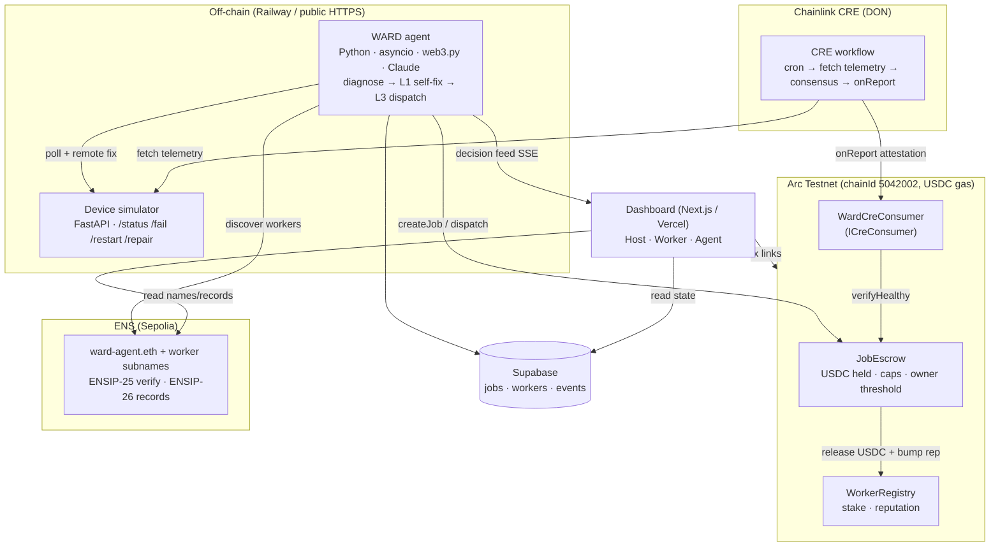

# WARD — Architecture



```
[Device simulator (FastAPI, public HTTPS via Railway/Fly)]
   ▲ poll + remote-fix calls          ▲ HTTP fetch (telemetry)
[Agent (plain Python: asyncio + web3.py + Claude API)]      [Chainlink CRE workflow]
   │ txs (createJob / dispatch)                               │ attestation → settle
   ▼                                                          ▼
[Arc testnet: USDC JobEscrow + WorkerRegistry + agent wallet]
   ▲                                       ▲
[Next.js frontend on Vercel — Host / Worker / Agent personas]
[Supabase — persistent demo state (jobs, feed, reputation cache)]
[ENS on Sepolia — ward-agent.eth + worker subnames (ENSIP-25/26)]
```

## Components

| Component | Tech | Why |
|---|---|---|
| Escrow + registry | Solidity (Foundry) on **Arc testnet**, native USDC | Arc's bounty lists "conditional escrow with onchain automation and automatic release" as its #1 example. JobEscrow: createJob (per-job + daily caps, owner approval required above threshold), acceptJob (staked workers only), settle gated on CRE attestation, deadline auto-refund, full event trail. |
| Sensor attestation | **Chainlink CRE workflow** (TS SDK) | Fetches device telemetry from the public HTTPS endpoint, verifies the fault is resolved, triggers escrow release on Arc. The technical core. CLI simulation qualifies for the bounty; Chainlink deploys simulated workflows live at the event. |
| Agent | **Plain Python**: asyncio loop, web3.py, Claude API for reasoning. No uAgents. | Poll fleet → diagnose → L1 remote fix → on hard failure query registry, select highest-reputation worker → escrow → monitor → trigger CRE → confirm settle. Decision feed streamed to frontend. |
| Identity | **ENS on Sepolia** | Agent primary name (ward-agent.eth). Workers get subnames (mike.ward-agent.eth) with **ENSIP-26 text records**: skills, region, reputation pointer. **ENSIP-25** name verification for the agent. Agent discovers workers via ENS resolution. |
| Audit | Arc contract events, indexed by the frontend | No separate audit chain. |
| Frontend | **Next.js + Tailwind on Vercel**, clean light aesthetic (docs/DESIGN.md) | Three personas via dropdown: Host / Worker / Agent. Worker view mobile-first, reachable by QR code. |
| Demo state | **Supabase** (free tier) | State persists across all judge visits: reputation accumulates, activity feed grows. By Sunday the app shows dozens of real historical Arc transactions, not a fresh demo. |
| Device sim | FastAPI on **Railway or Fly.io** (public HTTPS so CRE can reach it) | Per-property devices (router etc.): status / kill (soft\|hard) / restart (heals soft only) / repair. Node-console page for triggers. |

## Open question (gates the CRE build)

**Does CRE write to Arc testnet?** Ask the Chainlink booth directly. Outcomes:
1. CRE → Arc directly: ideal, plan stands.
2. CRE → other EVM chains only: escrow on Base Sepolia, bridge to Arc for USDC settlement via Circle's stack.
3. CRE too slow for live demo: pre-stage one complete cycle visible on the Arc explorer; run the live cycle in parallel during Q&A.

Do not start the CRE integration until the booth answer is confirmed. Full decision matrix: docs/SPIKES.md.

## Fallbacks

- Arc fundamental issues → escrow on Base Sepolia, disclose honestly to judges.
- ENS stays on Sepolia regardless.
- Any non-anchor integration blocked >2h after a serious attempt → cut it (docs/CUTS.md).
