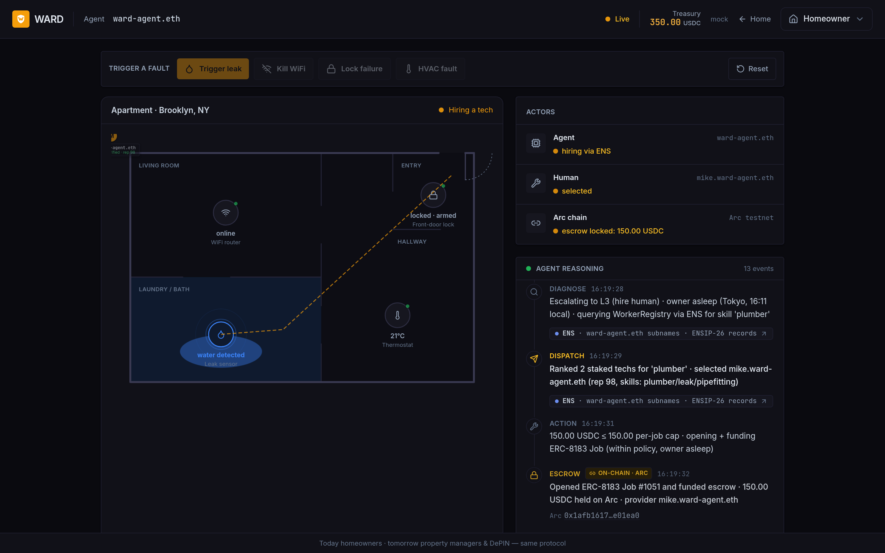
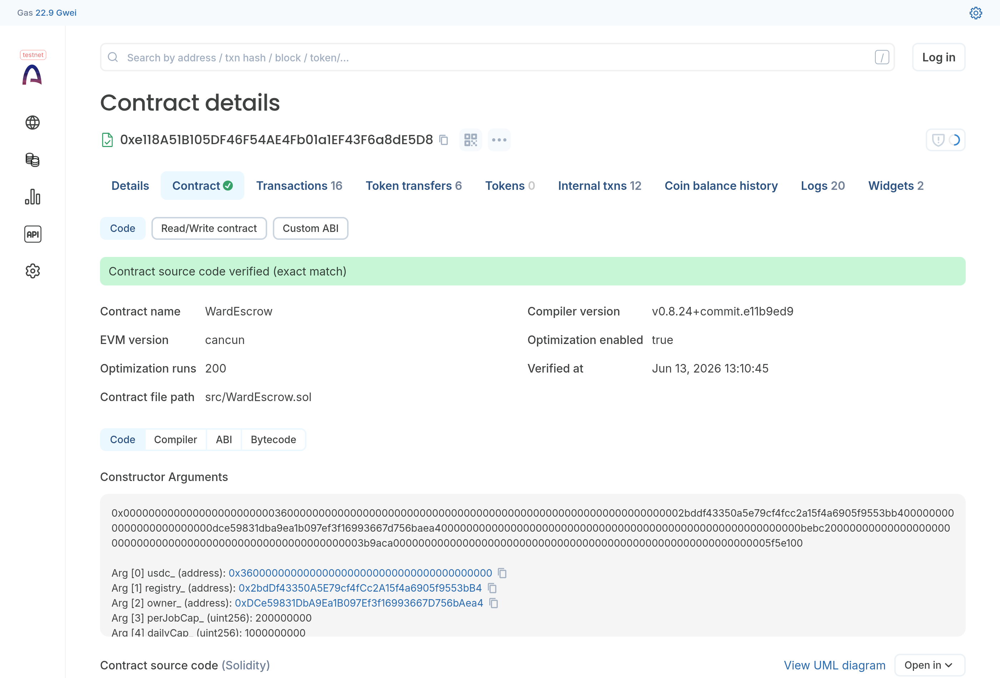
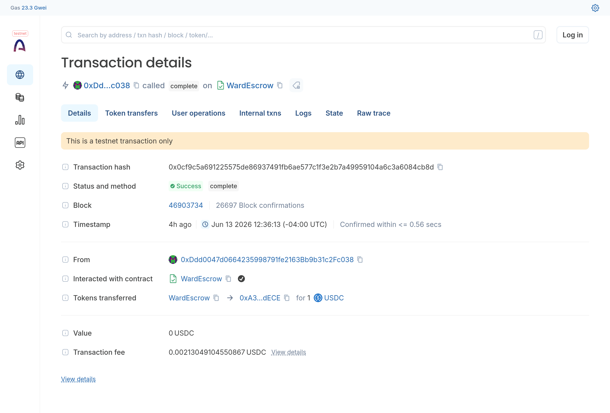
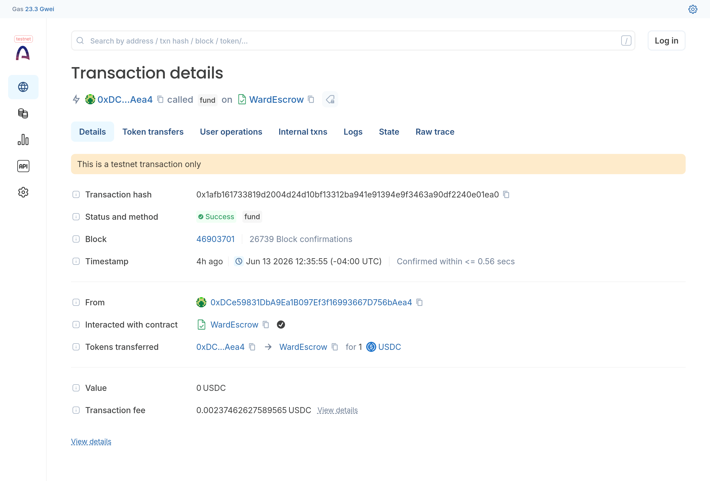
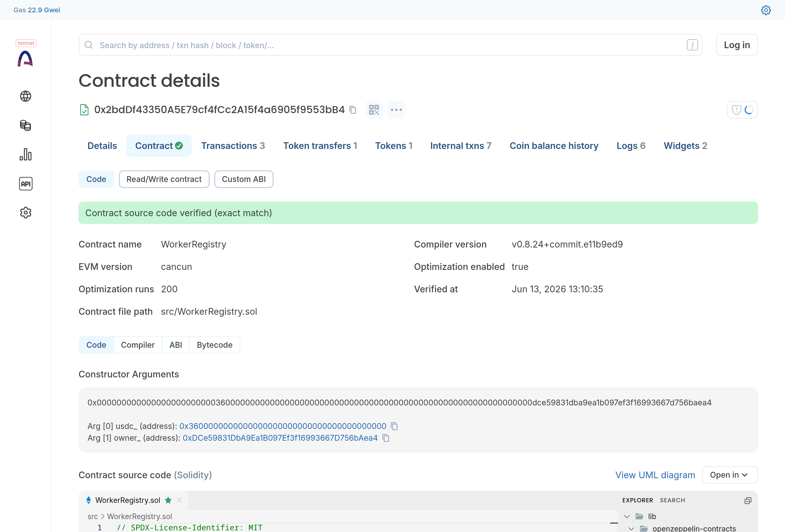
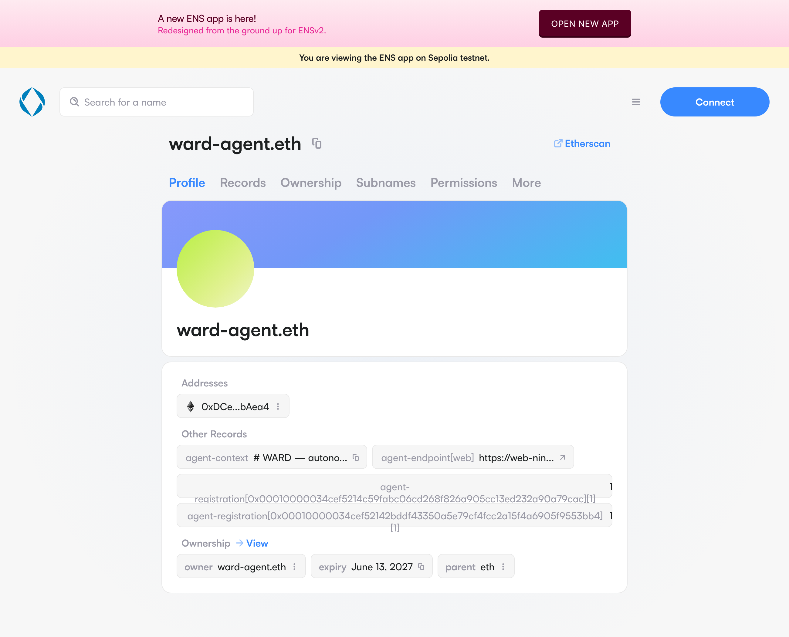
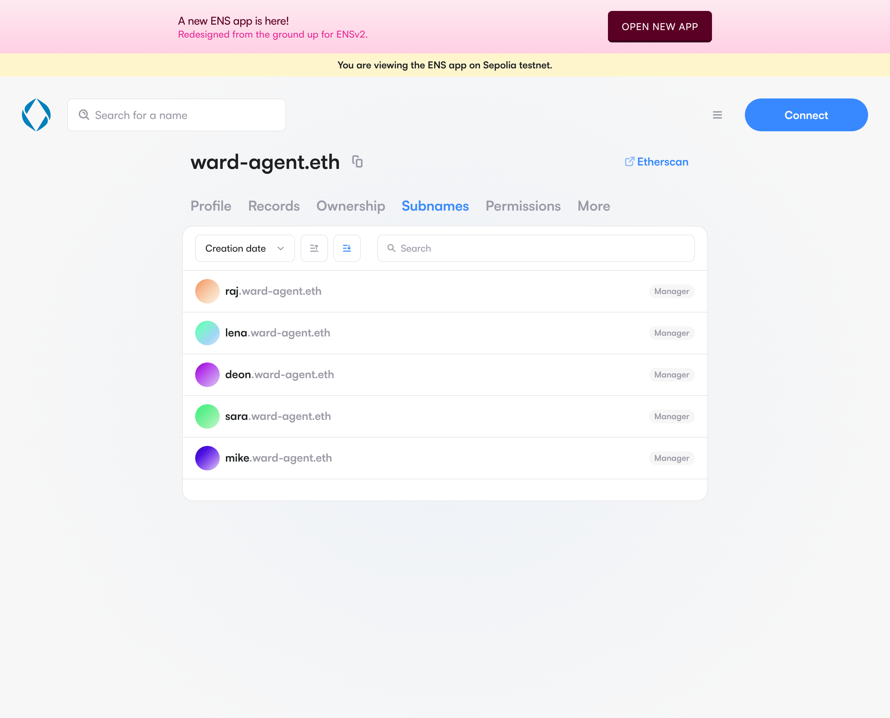
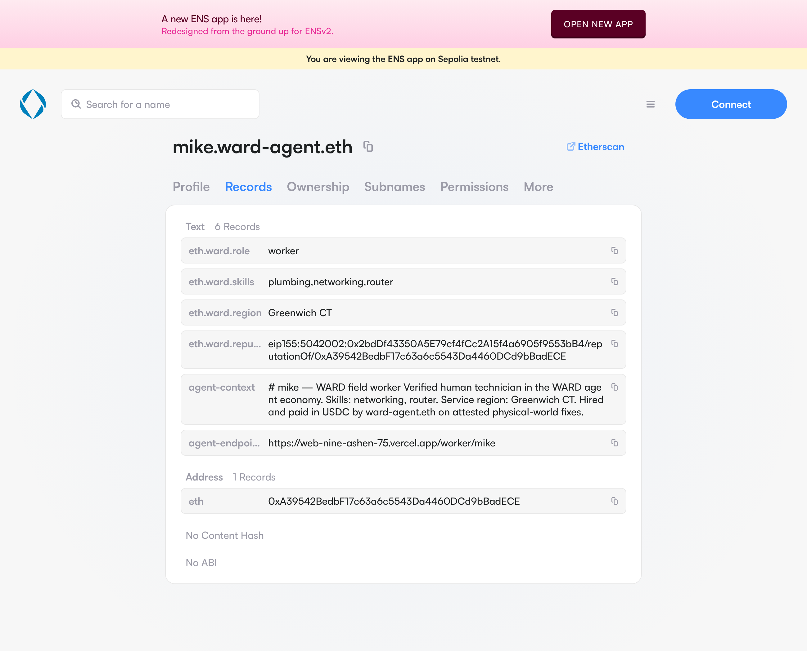

# WARD

WARD is rails for an autonomous system to hire and pay a verified human for physically-verifiable work, settled on-chain. The instrumented home is the first instance, not the product: a home agent watches your devices, fixes what it can in software, and when the fault is physical it hires a verified human and pays them in USDC the moment a sensor attests the repair. Nobody clicks approve. The sensor does.

It runs end to end on Arc testnet: worker identity and discovery on ENS, escrow and settlement on Arc, and the fix attested by a Chainlink CRE workflow. It is a working implementation of ERC-8183, Ethereum's Agentic Commerce standard.

## Links

| | |
|---|---|
| Live homepage | https://web-nine-ashen-75.vercel.app |
| Live demo (cinematic) | https://web-nine-ashen-75.vercel.app/demo |
| Demo video | (link added on submission) |
| GitHub (open source) | https://github.com/joeykokinda/ward |
| WardEscrow (ERC-8183, source-verified) | https://testnet.arcscan.app/address/0xe118A51B105DF46F54AE4Fb01a1EF43F6a8dE5D8 |
| WorkerRegistry (source-verified) | https://testnet.arcscan.app/address/0x2bdDf43350A5E79cf4fCc2A15f4a6905f9553bB4 |
| Evaluator (CRE oracle EOA) | https://testnet.arcscan.app/address/0xDdd0047d0664235998791fe2163Bb9b31c2Fc038 |
| USDC (native Arc, 6dp, also gas) | `0x3600000000000000000000000000000000000000` |
| ENS records (Sepolia) | https://sepolia.app.ens.domains/ward-agent.eth |
| CRE sim log (green) | `cre/sim-output-live.txt` |
| All transaction hashes | [DEMO-EVIDENCE.md](DEMO-EVIDENCE.md) |

Arc network: chainId `5042002`, RPC `https://rpc.testnet.arc.network`, explorer `https://testnet.arcscan.app`. CRE: chain-selector `3034092155422581607`, forwarder `0x76c9cf548b4179F8901cda1f8623568b58215E62`.

## See it run

A 2am leak, the owner asleep in Tokyo. WARD detects it, fails the free remote fix, hires a plumber via ENS, locks USDC escrow on Arc, and releases payment when a Chainlink CRE workflow confirms the sensor reads dry. About 27 seconds, every step on-chain. [Watch the live demo.](https://web-nine-ashen-75.vercel.app/demo)



## Verifiable on-chain

Both contracts are source-verified on Arc, and the demo's transaction links resolve to real `fund` and `complete` calls on the live escrow. These are screenshots from [testnet.arcscan.app](https://testnet.arcscan.app); every address and hash is clickable in the Links table above.

**WardEscrow, source code verified (ERC-8183 Job escrow):**



**The whole thesis in one transaction: the Evaluator calls `complete()`, which releases USDC to the worker.** No owner signature, no human approval. The release is signed by the CRE oracle address (`0xDdd0047...c038`), not the owner. It shows 1 USDC because live jobs are faucet-bounded on testnet; the cinematic narrates a 150 USDC dispatch, but every settlement link points to a real on-chain release like this:



**The agent (Client) funding the escrow with `fund()`:**



**WorkerRegistry, source code verified (stake + reputation):**



## ENS, live on Sepolia

Worker identity and discovery run on real ENS, not a label on top of a database. `ward-agent.eth` carries an ENSIP-25 `agent-registration` record that verifies against the Arc WorkerRegistry. Each field tech is a subname with ENSIP-26 text records, and the agent resolves them live to discover and rank candidates. Nothing is hardcoded; the UI reads all of it through `/api/ens`. Screenshots from the ENS app on Sepolia ([sepolia.app.ens.domains](https://sepolia.app.ens.domains/ward-agent.eth)):

**The agent name, with its ENSIP-25 `agent-registration` record and agent-context:**



**The worker registry: five field techs registered as subnames of `ward-agent.eth`:**



**A worker's ENSIP-26 records: skills, region, role, and a reputation pointer:**



That reputation record is a CAIP-10 pointer, `eip155:5042002:0x2bdD...3bB4/reputationOf/0xA395...dECE`. ENS holds the portable identity; the Arc WorkerRegistry holds the live reputation. The agent reads the ENS record to find the worker, follows the pointer to read reputation on-chain, and ranks by skill match plus score. That is how a worker's reputation stays ENS-owned and portable while remaining on-chain and tamper-evident: another agent network could read the same records tomorrow and hire the same person, no re-signup.

## The homeowner is the demo. The customer is software.

The homeowner is the demo because the pain is visceral: it's 2am, you're asleep in a hotel in Tokyo, and the leak sensor in your Brooklyn apartment just tripped. WARD can't fix water with a reboot, so it discovers and hires Mike (`mike.ward-agent.eth`), escrows USDC on Arc, and dispatches him. Mike fixes the leak, the moisture sensor reads dry, a Chainlink CRE workflow attests it on-chain, and the escrow releases. You slept through the whole thing.

The actual customer is software with no bank account: DePIN fleets paying the humans who keep their hardware alive, smart-contract DAOs posting proof-gated repair jobs, AI-agent treasuries settling with field techs on attested evidence. When a judge asks "why crypto," the honest answer is: for one homeowner paying a local plumber, traditional payment rails like credit cards and ACH work fine. Crypto is load-bearing only when the buyer is software that cannot open a bank account. WARD is the reference implementation of ERC-8183 those buyers need, and the homeowner is the most legible way to show it working.

## Architecture

Full component diagram (mermaid) is in [ARCHITECTURE.md](ARCHITECTURE.md). The whole ERC-8183 Job lifecycle is single-chain on Arc: no bridge, no second EVM. The CRE workflow fetches device telemetry from a public HTTPS endpoint, runs DON consensus, and produces a `WriteReport` to Arc that drives `complete()` on the escrow.

```
[Device sim (FastAPI, public HTTPS via Tailscale Funnel)]
   ^ poll + remote-fix          ^ HTTP fetch (telemetry)
[WARD agent = ERC-8183 Client (Python: asyncio + web3.py + Claude)]    [Chainlink CRE = Evaluator]
   | createJob / setBudget / fund                                       | attestation -> complete()
   v                                                                    v
[Arc testnet: WardEscrow (ERC-8183) + WorkerRegistry, native USDC]
   ^                                    ^
[Next.js frontend (Vercel): homepage + cinematic /demo, Host / Worker / Agent personas]
[ENS on Sepolia: ward-agent.eth + 5 worker subnames (ENSIP-25/26 + CAIP-10 reputation pointers)]
```

ERC-8183 defines a *Job*: an escrowed budget, three roles, one state machine. The standard says the **Evaluator** alone releases escrow. It never says the Evaluator has to be human. WARD makes the Evaluator a sensor:

| ERC-8183 role | WARD |
|---|---|
| **Client** | The autonomous home agent. Requests the repair, funds the escrow. |
| **Provider** | The field tech who shows up and fixes the hardware. Calls `submit`. |
| **Evaluator** | The Chainlink CRE workflow. Reads device telemetry, attests the fix, and is the only role that calls `complete()`, which releases USDC and bumps the worker's reputation. |

## The escalation ladder

WARD does not jump to hiring a human. It climbs a ladder, cheapest first. **L1 self-fix** is free, instant, and autonomous: software remedies the agent runs itself (reboot, reconfigure, re-pair, cycle a relay, close a smart valve). Most incidents end here, and this is the everyday value. **L2 guided remote** is an optional scripted multi-step remediation, still no human. **L3 hire a human** is the last resort, used only when the fault is physical and software cannot resolve it: it spends money and dispatches a person, so it runs only within the owner's spending policy. In the demo a WiFi fault is fixed at L1 by a remote reboot (no human, no escrow); the 2am leak fails L1 because the burst is upstream of the valve, so it escalates to L3 and hires a plumber. That contrast is the point: the agent is intelligent, not "always hires a human." How the agent thinks (the full ladder, per-device steps, worker selection, and roadmap) is specced in [docs/AGENT-PLAYBOOK.md](docs/AGENT-PLAYBOOK.md).

## The three integrations

**Chainlink CRE (the Evaluator).** A CRE workflow is the technical core. On a cron tick it fetches device telemetry from the public HTTPS sim, runs identical-consensus to verify the fault is resolved, and produces an EVM `WriteReport` to Arc that drives `complete()` on the Job. The contract trusts the attestation, not a human. Without CRE, ERC-8183 still needs a human in the loop and this is just another agent with a wallet. The green CLI simulation (`cre/sim-output-live.txt`) is the qualifying bar.

**Arc (the settlement rail).** WardEscrow is a keyed ERC-8183 JobEscrow holding native USDC under a real policy layer: per-job caps, daily caps, an owner-approval threshold, and deadline auto-refund (the standard's Expired state), all in the contract, not middleware. The Job runs Open to Funded to Submitted to Completed, and the Evaluator auto-releases the instant the attestation lands. USDC is also the gas token on Arc, so settlement is gas-free and sub-cent: a sub-$200 dispatch fee that mainnet gas would eat alive is negligible here. Both contracts are source-verified; 56 forge tests pass.

**ENS (identity and discovery).** The agent holds its own primary name `ward-agent.eth`, verified per ENSIP-25. Every worker is a subname carrying ENSIP-26 text records (skills, region, and a CAIP-10 reputation pointer to the on-chain registry). When a Job needs a Provider, the agent discovers and ranks workers through live ENS resolution: ENS is the registry, not a label on top of one, and the reputation is ENS-owned and portable. The UI resolves all of this live via `/api/ens` with zero hardcoded values.

## Setup / run

Local full stack with no external credentials. Brings up anvil, deploys contracts, seeds 5 workers plus the agent treasury and 3 settled historical jobs, starts the device sim on `:8090` and the agent on `:8091`, all wired to a MockCreVerifier so settlement works on anvil with no real CRE or signatures:

```bash
scripts/dev-stack.sh up        # start anvil + deploy + seed + sim + agent (LIVE on anvil)
scripts/dev-stack.sh status    # show what's running
scripts/dev-stack.sh down      # tear down
```

Trigger a real on-chain hard-fault incident against the local stack:

```bash
curl -X POST http://localhost:8091/incident/simulate \
     -H 'content-type: application/json' \
     -d '{"propertyId":"prop-2","mode":"hard","autoComplete":true}'
curl -N http://localhost:8091/events     # watch the reasoning stream
```

Run the contract tests:

```bash
cd contracts && export PATH=$HOME/.foundry/bin:$PATH && forge test
```

Run the frontend against the local stack (`web/`):

```bash
cd web && NEXT_PUBLIC_DATA_ADAPTER=live NEXT_PUBLIC_AGENT_URL=http://localhost:8091 pnpm dev
```

Prerequisites: `forge` (Foundry), `uv` (Python env), and `jq`. Live deploy to Arc and the always-on backend are documented in [docs/DEPLOY.md](docs/DEPLOY.md) and [docs/BACKEND-SETUP.md](docs/BACKEND-SETUP.md).

## Built during the hackathon vs reused libraries

Written from scratch during the event:

- **Contracts** (`contracts/`): WardEscrow (the ERC-8183 keyed JobEscrow + policy layer), WorkerRegistry, the CRE verifier seam, deploy + seed scripts, 56 forge tests.
- **Agent** (`agent/`): the autonomous runtime in plain Python (asyncio poll loop, web3.py, Claude API for reasoning, ENS-driven worker discovery and ranking, escalation ladder, SSE decision feed). No agent framework.
- **CRE workflow** (`cre/`): the TS SDK workflow that fetches telemetry, runs consensus, and produces the `WriteReport` to Arc, plus the on-chain consumer.
- **Frontend** (`web/`): the Next.js homepage and cinematic demo, floor-plan hero animation, the three personas, and the live ENS resolver route.
- **ENS setup** (`packages/ens/`): subname minting, ENSIP-25/26 record writes, the ERC-7930 verification key builder, and the discovery/ranking CLI.

Reused standard libraries (not reimplemented): Next.js, React, Tailwind, lucide, web3.py, viem, Foundry, OpenZeppelin, FastAPI. The first commit is a docs scaffold created right after kickoff; the build proceeds as frequent incremental commits showing real progression (never a single large dump, never backdated).

## AI tool disclosure

This project was built using Claude Code as the primary development environment with spec-driven workflows. All spec files, prompts, and planning artifacts are committed to `/docs`. The developer made all architectural decisions, integration choices, and verified all functionality before commits. Claude assisted with implementation.

The spec and prompt artifacts live in [docs/](docs/) and are indexed in [docs/specs/README.md](docs/specs/README.md). The canonical judge-ready build spec is at `docs/specs/judge-ready-submission-spec.md`.

## Doc map

Judge-facing (root): README, [PROJECT.md](PROJECT.md), [ARCHITECTURE.md](ARCHITECTURE.md), [BOUNTIES.md](BOUNTIES.md), [DEMO.md](DEMO.md), [DEMO-EVIDENCE.md](DEMO-EVIDENCE.md), [PITCHES.md](PITCHES.md), [SUBMISSION.md](SUBMISSION.md), [VIDEO-SCRIPT.md](VIDEO-SCRIPT.md), [BOUNTY-AUDIT.md](BOUNTY-AUDIT.md), [STATUS.md](STATUS.md).

Internal process: [docs/](docs/) (SPIKES, CUTS, INTEGRATION, TODO, BACKEND-SETUP, INTERFACES, DEPLOY, DESIGN), indexed in [docs/specs/README.md](docs/specs/README.md).
